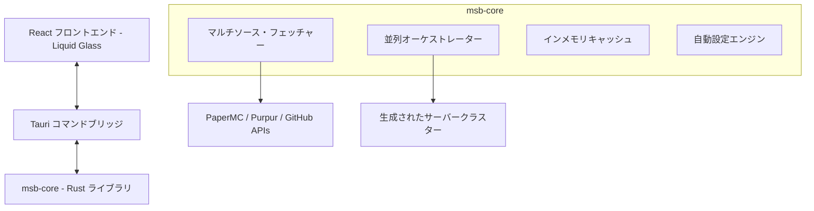

# 🚀 Minecraft Server Constructor (MSB)

[](https://github.com/rea/msb/actions/workflows/build.yml)
[](LICENSE.md)

**MSB (Minecraft Server Builder)** は、Minecraft サーバークラスターのための高性能かつプロフェッショナル仕様のオーケストレーターです。**Rust** と **React (Tauri)** で構築されており、複雑なサーバー環境を数秒でデプロイできる、シームレスな「Liquid Glass」デスクトップ体験を提供します。

---

## ✨ 主な機能

- **🚀 超高速並列デプロイ**: Rust の `tokio` ランタイムを活用し、複数のサーバーコンポーネント（バックエンド、プロキシ、Limbo）を同時にオーケストレートします。
- **🧊 Liquid Glass UI**: macOS にインスパイアされたプレミアムなガラスモーフィズムインターフェース。滑らかなアニメーションとマルチテーマ（Light, Dark, OLED）をサポート。
- **🌍 多言語サポート**: 日本語、英語、中国語、韓国語を含む 22 言語に完全ローカライズ。
- **🦀 ゼロコスト最適化**: メモリ安全性と CPU 効率を追求したコアライブラリと、高度なキャッシュ層を搭載。
- **🛡️ 組み込みセキュリティ**: SSH の堅牢化やファイアウォール設定を自動化し、本番環境レベルのクラスターを構築。
- **🧩 高度なプラグイン連携**: Geyser, Floodgate, ViaVersion, DiscordSRV などの動的取得と自動設定。

---

## 🛠 技術スタック

### バックエンド (Core & Bridge)
- **Rust**: 速度と安全性のためのコアエンジン。
- **Tauri v2**: ネイティブ OS と Web 技術を繋ぐセキュアなブリッジ。
- **Tokio**: 高並列オーケストレーションのための非同期ランタイム。
- **Reqwest**: マルチソースからの JAR 取得に最適化された HTTP クライアント。

### フロントエンド (GUI)
- **React 19**: モダンな UI コンポーネント設計。
- **Tailwind CSS**: ユーティリティファーストなスタイリングとカスタムガラス層。
- **Framer Motion**: 流体のようなアニメーションと遷移。
- **Zustand**: 軽量でリアクティブな状態管理。
- **i18next**: 堅牢な国際化フレームワーク。

---

## 📐 アーキテクチャ



---

## 🚀 始め方

### 必須環境
- [Rust](https://www.rust-lang.org/tools/install) (最新の stable)
- [Node.js](https://nodejs.org/) (v18 以上)
- [Tauri CLI](https://tauri.app/v1/guides/getting-started/prerequisites)

### ビルド & 実行
1. リポジトリをクローン:
   ```bash
   git clone https://github.com/rea/msb.git
   cd msb
   ```
2. フロントエンドの依存関係をインストール:
   ```bash
   npm install
   ```
3. 開発モードで実行:
   ```bash
   npm run tauri dev
   ```
4. 本番用にビルド:
   ```bash
   npm run build
   ```

---

## 🤝 コントリビュート

コミュニティからのコントリビュートを歓迎します！詳細は [CONTRIBUTING.md](CONTRIBUTING.md) をご覧ください。

---

## 📄 ライセンス

このプロジェクトは **MSB Attribution License (Modified MIT)** のもとでライセンスされています。フォークや配布は自由ですが、オリジナルプロジェクトと作者への帰属表示が**必須**です。詳細は [LICENSE.md](LICENSE.md) を参照してください。

---

**Developed with ❤️ by MSB Project Team & Rea**
