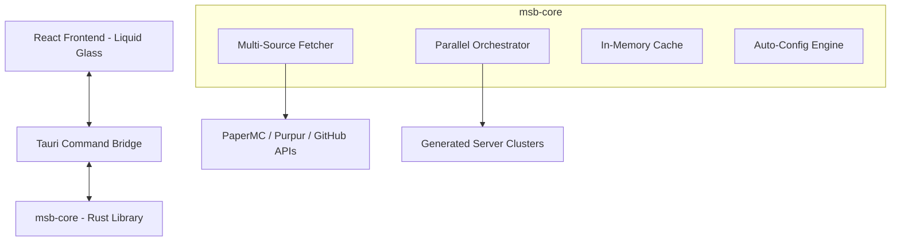

# 🚀 Minecraft Server Constructor (MSB)

[](https://github.com/rea/msb/actions/workflows/build.yml)
[](LICENSE.md)

**MSB (Minecraft Server Builder)** is a high-performance, professional-grade orchestrator for Minecraft server clusters. Built with **Rust** and **React (Tauri)**, it provides a seamless, "Liquid Glass" desktop experience for deploying complex server environments in seconds.

---

## ✨ Key Features

- **🚀 Ultra-Fast Parallel Deployment**: Utilizes Rust's `tokio` runtime to orchestrate multiple server components (Backend, Proxy, Limbo) concurrently.
- **🧊 Liquid Glass UI**: A premium, macOS-inspired glassmorphism interface with smooth animations and multi-theme support (Light, Dark, OLED).
- **🌍 Multi-Language Support**: Fully localized in 22 languages, including Japanese, English, Chinese, Korean, and more.
- **🦀 Zero-Cost Optimization**: Memory-safe and CPU-efficient core library with intelligent caching layers.
- **🛡️ Built-in Security**: Automated SSH hardening and firewall configurations for production-ready clusters.
- **🧩 Advanced Plugin Orchestration**: Dynamic fetching and configuration of Geyser, Floodgate, ViaVersion, DiscordSRV, and more.

---

## 🛠 Tech Stack

### Backend (Core & Bridge)
- **Rust**: The core engine for speed and safety.
- **Tauri v2**: The secure bridge between native OS and web technologies.
- **Tokio**: Asynchronous runtime for high-concurrency orchestration.
- **Reqwest**: Optimized HTTP client for multi-source JAR fetching.

### Frontend (GUI)
- **React 19**: Modern UI component architecture.
- **Tailwind CSS**: Utility-first styling with custom glassmorphism layers.
- **Framer Motion**: Fluid animations and transitions.
- **Zustand**: Lightweight, reactive state management for notifications.
- **i18next**: Robust internationalization framework.

---

## 📐 Architecture



---

## 🚀 Getting Started

### Prerequisites
- [Rust](https://www.rust-lang.org/tools/install) (latest stable)
- [Node.js](https://nodejs.org/) (v18 or higher)
- [Tauri CLI](https://tauri.app/v1/guides/getting-started/prerequisites)

### Build & Run
1. Clone the repository:
   ```bash
   git clone https://github.com/rea/msb.git
   cd msb
   ```
2. Install frontend dependencies:
   ```bash
   npm install
   ```
3. Run in development mode:
   ```bash
   npm run tauri dev
   ```
4. Build for production:
   ```bash
   npm run build
   ```

---

## 🤝 Contributing

We welcome contributions from the community! Please see our [CONTRIBUTING.md](CONTRIBUTING.md) for guidelines on how to get involved.

---

## 📄 License

This project is licensed under the **MSB Attribution License (Modified MIT)**. You are free to fork and distribute, but you **must** provide attribution to the original project and authors. See [LICENSE.md](LICENSE.md) for full details.

---

**Developed with ❤️ by MSB Project Team & Rea**
